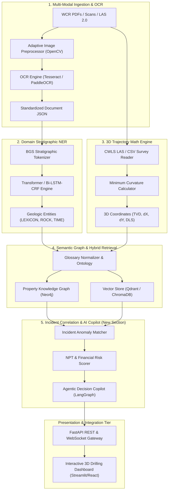

# System Architecture & Technical Specifications

## 1. High-Level Architecture Overview

GeoDrill-AI is organized as a decoupled, multi-tiered AI pipeline operating over multi-modal exploration data:

---

## 2. Mathematical Formulation: Minimum Curvature Algorithm (Layer 3)

For two survey stations $i$ and $i+1$ with Measured Depths $MD_1, MD_2$, Inclinations $I_1, I_2$, and Azimuths $A_1, A_2$:

1. **Dogleg Angle ($\beta$)**:
$$\cos \beta = \cos(I_2 - I_1) - \sin I_1 \sin I_2 [1 - \cos(A_2 - A_1)]$$

2. **Ratio Factor ($RF$)**:
$$RF = \frac{2}{\beta} \tan\left(\frac{\beta}{2}\right) \quad (\text{as } \beta \to 0, \, RF \to 1)$$

3. **Incremental Displacements**:
$$\Delta \text{TVD} = \frac{\Delta MD}{2} (\cos I_1 + \cos I_2) \times RF$$
$$\Delta \text{North} = \frac{\Delta MD}{2} (\sin I_1 \cos A_1 + \sin I_2 \cos A_2) \times RF$$
$$\Delta \text{East} = \frac{\Delta MD}{2} (\sin I_1 \sin A_1 + \sin I_2 \sin A_2) \times RF$$

4. **Dogleg Severity (DLS)**:
$$\text{DLS} = \frac{\beta}{\Delta MD} \times 100 \text{ (deg/100 ft) or } \frac{\beta}{\Delta MD} \times 30 \text{ (deg/30 m)}$$

---

## 3. Layer 5 Incident Correlation Architecture (New Section)

The incident correlation engine integrates:
* **Lithology / Formation Zone**: Matched against known formation risk profiles (e.g., Monterey, Antelope Shale, Inigok sandstones).
* **Trajectory Parameters**: High DLS (>3.5 deg/30m) or rapid inclination build zones.
* **Historical Failure Modes**:
  * Lost Circulation & Mud Loss
  * Differential Sticking & Mechanical Stuck Pipe
  * Gas Influx / Kick & Well Control Risk
  * $H_2S$ and Toxic Gas Influx
* **Mitigation Synthesis**: Dynamic generation of emergency response checklists and mud property adjustments.
