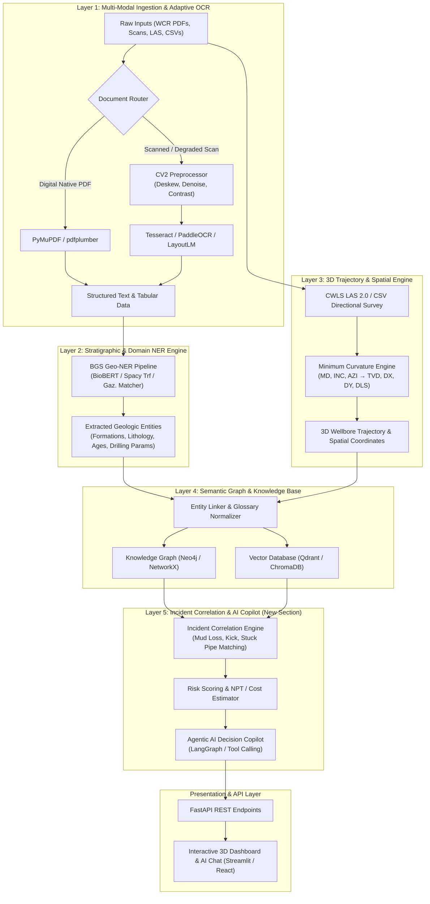

# GeoDrill-AI: Upstream Exploration & Drilling AI Pipeline

Upstream Oil & Gas / Geothermal Exploration, Drilling Intelligence, and Subsurface Risk Mitigation Platform.

This platform processes multi-modal historical and real-time drilling datasets (Well Completion Reports, Directional Surveys, Daily Drilling Reports, Incident Logs) across a **5-Layer AI Pipeline** to reduce drilling hazards, mitigate Non-Productive Time (NPT), and deliver actionable subsurface insights.

---

## 🏗️ End-to-End System Architecture Flowchart



---

## ⚡ The 5-Layer AI Pipeline

| Layer | Component | Core Functionality | Technologies |
| :--- | :--- | :--- | :--- |
| **Layer 1** | **Multi-Modal Ingestion & OCR** | Ingests digital PDFs and degraded historical scans (blur, skew, noise); extracts structured tables and text. | `PyMuPDF`, `OpenCV`, `PaddleOCR`, `Tesseract` |
| **Layer 2** | **Stratigraphic & Domain NER** | Identifies geological formations, lithology types, chronostratigraphy, and drilling parameters using BGS datasets. | `Spacy`, `HuggingFace`, `BioBERT`, `Gazetteer` |
| **Layer 3** | **3D Trajectory & Spatial Math** | Parses CWLS LAS 2.0 / CSV surveys and calculates 3D well paths using the **Minimum Curvature Algorithm** (TVD, $dX$, $dY$, DLS). | `lasio`, `NumPy`, `SciPy`, `Plotly 3D` |
| **Layer 4** | **Semantic Graph & Enrichment** | Normalizes drilling abbreviations/units and links wellbores, formations, and operational data into a unified graph and vector store. | `Qdrant`, `ChromaDB`, `Neo4j`, `NetworkX` |
| **Layer 5** *(New)* | **Incident Correlation & AI Copilot** | Correlates formation depths and doglegs with historical drilling incidents (mud loss, stuck pipe, kicks) to forecast NPT and provide agentic root-cause recommendations. | `LangGraph`, `FastAPI`, `Pydantic AI` |

---

## 📂 Project Directory Structure

```text
geodrill-ai/
├── .github/workflows/          # CI/CD pipelines
├── config/                     # System & model configuration files
├── data/                       # Curated upstream drilling dataset
│   ├── wcr_digital/            # (10 PDFs) Digital-native Well Completion Reports
│   ├── wcr_scanned_clean/      # (6 PDFs)  Clean historical scanned reports
│   ├── wcr_scanned_bad/        # (6 PDFs)  Degraded edge-case scans (blur, skew, noise)
│   ├── well_metadata/          # (2 CSVs)  Master well index, lat/long, formation tops
│   ├── trajectory_survey/      # (10 files) Directional surveys (CSV & CWLS LAS 2.0)
│   ├── ddr_daily_reports/      # (8 files) Daily Drilling Reports (Equinor Volve based)
│   ├── glossary/               # (3 files) Drilling terminology, abbreviations, units
│   ├── mock_incidents/         # (2 files) 15 synthetic incident records with root causes
│   └── geo_ner/                # (7 files) Official BGS Geo-NER dataset
├── src/                        # Core AI Pipeline Modules
│   ├── layer1_ingestion/       # Multi-modal OCR & image enhancement
│   ├── layer2_ner/             # Stratigraphic entity extraction
│   ├── layer3_trajectory/      # Minimum curvature 3D computation
│   ├── layer4_knowledge_graph/ # Semantic graph & hybrid vector search
│   ├── layer5_copilot/         # Incident correlation & agentic decision support
│   └── api/                    # FastAPI backend endpoints
├── frontend/                   # 3D visualization and AI Copilot dashboard
├── notebooks/                  # EDA, algorithm validation, and benchmarking
├── tests/                      # Comprehensive test suite
├── Dockerfile                  # Container definition
├── docker-compose.yml          # Multi-service setup
└── README.md                   # Project documentation
```

---

## 📖 Extended Documentation
* **Product Requirements Document**: See [`PRD.md`](PRD.md) for functional requirements, personas, and metrics.
* **Architecture Specifications**: See [`ARCHITECTURE.md`](ARCHITECTURE.md) for deep-dive technical design.
* **Dataset Guide**: See [`data/README.md`](data/README.md) for dataset inventory and schemas.
